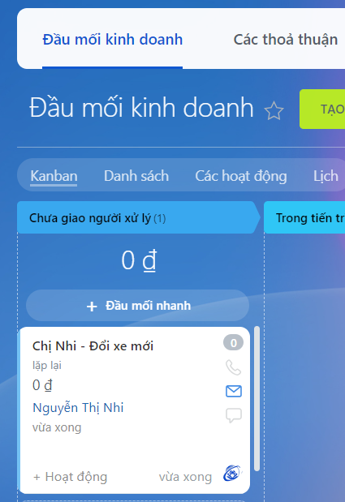

# Ứng dụng Tìm chỗ ngữa khách hàng trên Bitrix24
Ứng dụng là một ứng dụng cục bộ trên Bitrix24 được viết bằng ngôn ngữ PHP và sử dụng API của Bitrix24 giúp tìm ra "chỗ ngứa" của khách hàng. Từ thời gian vòng đời sản phẩm và thời gian đã mua hàng của khách hàng từ trước thì nhân viên có thể đánh giá và tiến hành tự động tạo đầu mối kinh doanh Lead để nhân viên sales có thể gọi điện tư vấn và bán hàng.

 
## Demo
Sau khi chọn ra được một khách hàng có thể có nhu cầu đổi mới sản phẩm thì ấn nút Add. Sau đó một form tạo Lead tự động sẽ hiện lên, với Id khách hàng được điền sẵn, việc cần làm chỉ là đặt tên Lead và bình luận dễ hiểu cho nhân viên sales gọi điện tư vấn cho khách hàng 

Sau khi điền thông tin và ấn Send thì sẽ tự động tạo Lead như hình bên dưới.

